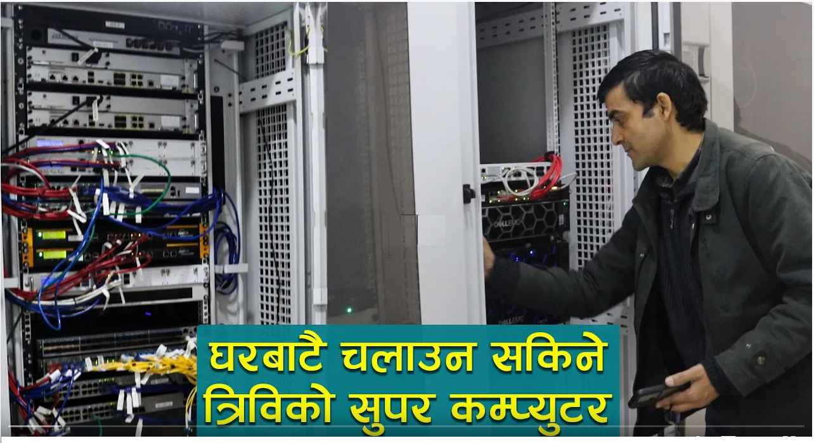

# Tribhuvan University Super Computing 

## Welcome to TU High-Performance Computing (HPC)

Tribhuvan University provides a **High-Performance Computing (HPC) environment** designed to support advanced research and computational workloads. Our HPC infrastructure enables researchers, faculty, and students to run large-scale simulations, machine learning models, and scientific computations efficiently.



## What is HPC?

High-Performance Computing (HPC) refers to the use of parallel processing to run **complex calculations at high speed**. TU's HPC cluster consists of **powerful computing nodes, GPUs, and optimized software stacks**, allowing researchers to process vast amounts of data faster than traditional computing environments.

## Key Features of TU HPC

- **Powerful Compute Nodes** – Multi-core CPU and GPU-based high-performance servers.
- **Parallel Computing** – Run large-scale simulations and computations efficiently.
- **Scalable Storage** – Secure, high-speed data storage for research projects.
- **SLURM Job Scheduler** – Efficient workload management with automated job queuing.
- **AI & Machine Learning Support** – Optimized environment for AI/ML workloads.
- **Scientific Software Stack** – Pre-installed software for research and engineering applications.
- **User Support & Documentation** – Guides, tutorials, and hands-on workshops.

## Why Use TU HPC?

TU HPC is available for **faculty, students, and researchers** engaged in computationally intensive projects. Our infrastructure supports research in:

- Artificial Intelligence & Machine Learning
- Computational Physics & Chemistry
- Climate & Environmental Modeling
- Genomics & Bioinformatics
- Engineering Simulations
- Big Data Analytics

## News & Maintenance

### Latest News
- **[March 2025]** 4 nodes is down at the cluster.
- **[Feburary 2024]** Upcoming HPC training workshop for researchers.
- **[January 2024]** Performance upgrade and system optimization.

### Maintenance Schedule
- **March 10, 2025**: Scheduled downtime for security updates.
- **April 5, 2025**: Hardware maintenance on storage servers.
- **May 15, 2025**: Cluster-wide software upgrades.

For real-time updates, visit our [Status Page](maintenance/status.md).


## Getting Started

### Step 1: Request an HPC Account
Access to TU HPC is granted to **eligible researchers and students**. To request an account, follow the [Access Guidelines](access/registration.md).

### Step 2: Connect to the HPC Cluster
After receiving your credentials, connect to the cluster via SSH:
```bash
ssh username@tu-ip-address
```
For detailed instructions, visit the [Getting Started Guide](getting_started/ssh.md).

### Step 3: Submit Your First Job
Learn how to run jobs using SLURM and optimize computing resources. See [SLURM Job Submission](slurm/submitting.md) for more details.

## Documentation Structure

- **[Access & Accounts](access/registration.md)** – How to get started with TU HPC.
- **[Job Scheduling](slurm/submitting.md)** – Running and managing jobs with SLURM.
- **[Software & Modules](software/modules.md)** – Using available software and environments.
- **[Data Management](storage/system.md)** – Storing and managing data on HPC.
- **[Parallel Computing](parallel/mpi_openmp.md)** – Leveraging parallel computing techniques.
- **[Best Practices](best_practices/optimization.md)** – Guidelines for efficient HPC usage.

## Need Help?
If you have any questions or require assistance, contact our **HPC Support Team** at [madhav [dot] ghimire@cdp [dot] tu [dot] edu [dot] np](mailto:)

> _Accelerate your research with TU HPC!_ 🚀